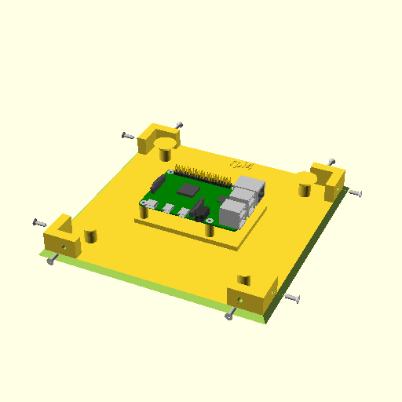
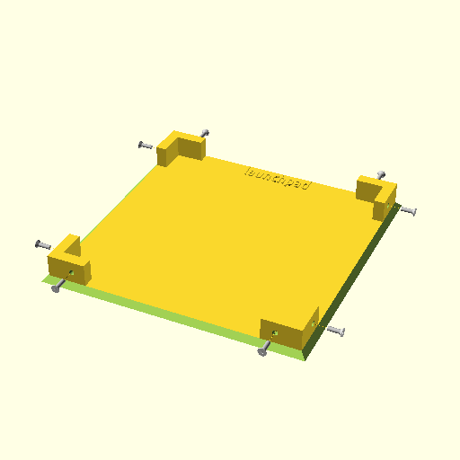
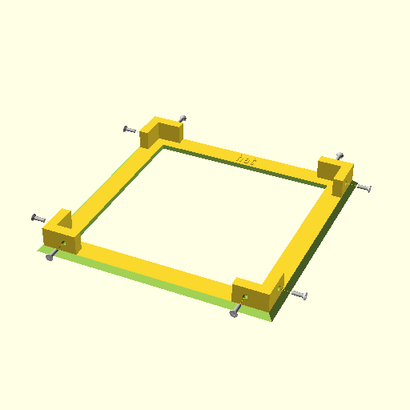
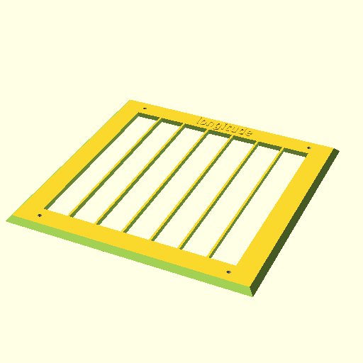

# Cubo

Cubo Assembled | Optional Stand
:---: | :---:
 | 

## What is Cubo?

Cubo is an extensible enclosure for Raspberry Pi and Arduino projects.

Because every project is different, Cubo provides a variety of building blocks to pick from during prototyping. The end result is a sturdy cube-shaped box that hosts, organizes, and protects the electronics of a project.

[OpenSCAD](https://openscad.org/) source code is available, and customizations and contributions to the project are welcome.

## Main features
- Supports **Arduino** (Leonardo, Nano, Uno R3) and **Raspberry Pi** (3, 4, Pico, Zero) out-of-the-box.
- Extendable to **custom boards**, with support for NVIDIA Jetson Nano and Google Coral Dev Board being next on the list.
- All sides have the same dimensions and hole positions to make them **interchangeable**. You can choose the sides that work best for your project, replace them as the project evolves, or swap them between projects.
- Sides are connected with screws for **durability**. You can choose between two versions: one with heat inserts, and one with good old screw nuts.
- The sides are 19x19cm which is big enough to host most dev boards **with ample space**, including wiring, and small enough to fit most 3D printers.
- **Easy to print** with default settings and no supports. STLs are provided here and on Printables. There are also ready-to-print sliced versions that work with Prusa i3 MK3S+ with PETG filament.

## Getting started

To build one Cubo, you need the following:
1. **3D print:** 1 bottom side, 1 top side, and 4 sides (see below for options).
1. **Cubo screws:** 16 M3x8 flat head screws and, either 16 M3 nuts or 16 [M3 heat inserts](https://www.cnckitchen.com/shop#!/Gewindeeinsatz-threaded-insert-M3-Standard-100-Stk-pcs/p/431146823/category=0).
1. **PCB screws:** Typically 4 M2.5 screws to attach the PCB and 4 [M2.5 heat inserts](https://www.cnckitchen.com/shop#!/Gewindeeinsatz-threaded-insert-M2-5-Standard-100-Stk-pcs/p/431146818/category=0). Alternatively, you can bring your own enclosure and glue/attach it to an empty bottom side.

*Download the files under [`stl`](/stl/) to slice the files for your printer and filament.* These are generally easy files to print. The default print settings should work and supports are not required.

For convenience, pre-sliced files are also provided for Prusa i3 MK3S+ with PETG filament under [`gcode`](/gcode/).

## Bottom side, aka the Launchpad

- [`cubo_bottom_insert_arduinoleonardo.stl`](/stl/cubo_bottom_insert_arduinoleonardo.stl)
- [`cubo_bottom_insert_arduinonano.stl`](/stl/cubo_bottom_insert_arduinonano.stl)
- [`cubo_bottom_insert_arduinouno3.stl`](/stl/cubo_bottom_insert_arduinouno3.stl)
- [`cubo_bottom_insert_nopcb.stl`](/stl/cubo_bottom_insert_nopcb.stl)
- [`cubo_bottom_insert_rpi0.stl`](/stl/cubo_bottom_insert_rpi0.stl)
- [`cubo_bottom_insert_rpi3.stl`](/stl/cubo_bottom_insert_rpi3.stl)
- [`cubo_bottom_insert_rpi4.stl`](/stl/cubo_bottom_insert_rpi4.stl)
- [`cubo_bottom_insert_rpipico.stl`](/stl/cubo_bottom_insert_rpipico.stl)
- [`cubo_bottom_nut_arduinoleonardo.stl`](/stl/cubo_bottom_nut_arduinoleonardo.stl)
- [`cubo_bottom_nut_arduinonano.stl`](/stl/cubo_bottom_nut_arduinonano.stl)
- [`cubo_bottom_nut_arduinouno3.stl`](/stl/cubo_bottom_nut_arduinouno3.stl)
- [`cubo_bottom_nut_nopcb.stl`](/stl/cubo_bottom_nut_nopcb.stl)
- [`cubo_bottom_nut_rpi0.stl`](/stl/cubo_bottom_nut_rpi0.stl)
- [`cubo_bottom_nut_rpi3.stl`](/stl/cubo_bottom_nut_rpi3.stl)
- [`cubo_bottom_nut_rpi4.stl`](/stl/cubo_bottom_nut_rpi4.stl)
- [`cubo_bottom_nut_rpipico.stl`](/stl/cubo_bottom_nut_rpipico.stl)

This is the first piece you'll want to print to host your dev board. The main decision you need to make is whether you'll use heat inserts or screw nuts. I tend to use heat inserts to avoid nuts accidentally falling on fragile electronics, but designs are provided for both inside the [`stl`](/stl/) folder.

We support Arduino (Leonardo, Nano, Uno R3) and Raspberry Pi (3, 4, Pico, Zero) by default.

Arduino Uno | Raspberry Pi 4
:---: | :---:
 | 

You can also bring your own enclosure (and hot glue it, for example) to add it to this minimal bottom side:

Heat inserts | Screw nuts
:---: | :---:
 | 

The end result looks like this for a Raspberry Pi board, with room around it for any required wiring. Note the heat inserts already installed on second photo:

Raspberry Pi | Heat inserts
:---: | :---:
 | 

If you want us to support another dev board please [open a ticket](https://github.com/zugaldia/cubo/issues).

## Top side, aka the Hat

- [`cubo_top_insert_empty.stl`](/stl/cubo_top_insert_empty.stl)
- [`cubo_top_insert_filled.stl`](/stl/cubo_top_insert_filled.stl)
- [`cubo_top_nut_empty.stl`](/stl/cubo_top_nut_empty.stl)
- [`cubo_top_nut_filled.stl`](/stl/cubo_top_nut_filled.stl)

The hat gives stability to the structure as you add sides to your project. There are two versions to choose from, one empty, and one solid. Similar to the Launchpad, there are also versions for heat inserts or screw nuts.

Empty hat | Solid hat
:---: | :---:
 | 

## Side options

# The basics

- [`cubo_empty.stl`](/stl/cubo_empty.stl)
- [`cubo_generic.stl`](/stl/cubo_generic.stl)

There are quite a few options when it comes to sides, but these two are always handy. An empty side so that you can look at the internals of your project, and a solid one, to protect it.

Generic empty side | Generic solid side
:---: | :---:
 | 

### The Arch

- [`cubo_arch.stl`](/stl/cubo_arch.stl)

This is a version of the empty side above, where the opening is at the bottom. This hole is handy to let all your larger external cables out (power, HDMI, ...).

### Grids

These sides are useful to let some airflow but also to attach components. The are two versions:
1. 20mm-wide hole which is big enough to let most USB or miniHDMI cables go through.
1. 10mm-wide hole ("small") which only allows thin cables and it's great for zip ties.

#### Flatiron

- [`cubo_grid_flatiron_medium.stl`](/stl/cubo_grid_flatiron_medium.stl)
- [`cubo_grid_flatiron_small.stl`](/stl/cubo_grid_flatiron_small.stl)

Lots of squares in a beautiful grid:

Flatiron | Flatiron small
:---: | :---:
 | 

#### Gruyere

- [`cubo_grid_gruyere_medium.stl`](/stl/cubo_grid_gruyere_medium.stl)
- [`cubo_grid_gruyere_small.stl`](/stl/cubo_grid_gruyere_small.stl)

A delicious variant of the flatiron grid:

Gruyere | Gruyere small
:---: | :---:
 | 

#### Longitude

- [`cubo_grid_longitude_medium.stl`](/stl/cubo_grid_longitude_medium.stl)
- [`cubo_grid_longitude_small.stl`](/stl/cubo_grid_longitude_small.stl)

I could also have called it the Jeep grid:

Longitude | Longitude small
:---: | :---:
 | 

#### Latitude

- [`cubo_grid_latitude_medium.stl`](/stl/cubo_grid_latitude_medium.stl)
- [`cubo_grid_latitude_small.stl`](/stl/cubo_grid_latitude_small.stl)

We couldn't have Longitude without Latitude:

Latitude | Latitude small
:---: | :---:
 | 

## Utils

### Mounting plates

- [`cubo_mounting_plate_m25.stl`](/stl/cubo_mounting_plate_m25.stl)
- [`cubo_mounting_plate_m3.stl`](/stl/cubo_mounting_plate_m3.stl)
- [`cubo_mounting_plate_m4.stl`](/stl/cubo_mounting_plate_m4.stl)
- [`cubo_mounting_plate_vesa.stl`](/stl/cubo_mounting_plate_vesa.stl)

The mounting plates let you attach components, inside or outside, to the grids listed above. There are variants for M2.5, M3, and M4 screws:

M2.5 | M3 | M4
:---: | :---: | :---:
 |  | 

There's also a version which is technically a VESA variant that some cameras use, where screws are 75mm apart:

You can see this mount holding a camera in these two photos:

Inside mount | Outside mount
:---: | :---:
 | 

### Stand

- [`cubo_stand_free_standing.stl`](/stl/cubo_stand_free_standing.stl)
- [`cubo_stand_with_base.stl`](/stl/cubo_stand_with_base.stl)

I mean, you don't really need a stand, the cubo stands very well on its own (on any of its sides). However, if you want to give your project a cool finish, try one of the stands (see photo at the beginning of this page). The one with the base is preferable for heavier projects or those that require more stability.

Stand | Stand with base
:---: | :---:
 | 

### Tray

- [`cubo_tray.stl`](/stl/cubo_tray.stl)

Another optional print, useful to keep your spare Cubo pieces together. The big subdivision hosts sides vertically. The 3 smaller subdivisions (labeled M2.5, M3, M4) can keep mounting plates and inserts/screws.

## Customizing and Contributing 

Cubo is developed using [OpenSCAD](https://openscad.org/), the code is open source and available in this repository.

You're free to download this code and modify it for your own projects, including commercial projects. Contributions are welcome. If you design a new side or fix an issue that you think could be useful to others, please open a pull request.

Repo structure:
- The source code is the `.scad` files in the root folder.
- The files in [`stl`](/stl/), [`png`](/png/), and [`gcode`](/gcode/) are auto generated from the OpenSCAD files. Don't edit them directly, your changes will be lost when the project is regenerated.
- The project depends on three excellent OpenSCAD libraries ([BOSL](https://github.com/revarbat/BOSL), [NopSCADlib](https://github.com/nophead/NopSCADlib), and [openscad-tray](https://github.com/sofian/openscad-tray)) that you'll need to download to the root folder for the project to build.
- [`assets`](/assets/) contains photos and PrusaSlicer settings to generate GCode files for Prusa i3 MK3S+ with PETG filament.

Use the `Makefile` to build the project with `make cubo`.

## Reporting issues and Feedback

If you run into any issues or have any feedback, please [open a ticket](https://github.com/zugaldia/cubo/issues) and tag me (`@zugaldia`).

Happy hacking.
